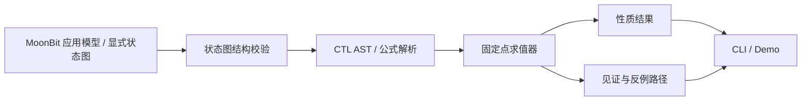

# 项目提案：MoonCTL

## 1. 项目名称

**MoonCTL — MoonBit 有限状态系统的 CTL 性质检查库**

## 2. 一句话介绍

> 一个为 MoonBit 生态提供可复用的时间逻辑性质检查与反例重放能力的开源项目。

## 3. 为什么现在需要它

MoonBit 已有状态建模与形式化基础：[MoonBDD](https://mooncakes.io/docs/oyjh0381/moonbdd) 处理符号布尔空间，[MoonPetri](https://mooncakes.io/docs/okMambaOut/moonpetri%400.1.0) 处理 Petri 网可达性与死锁，[moon prove](https://docs.moonbitlang.com/en/latest/language/verification.html) 验证程序契约。但是工作流、协议、Agent 工具链的开发者还缺一层方便复用的时序性质表达：例如“每种可能执行路径始终不重复扣款”（AG）、“存在路径最终恢复”（EF）、“任何请求最终有响应”（AF）。普通单路径单元测试很难覆盖分支与循环。

MoonCTL 让调用方提供有限的带标签状态图，用 CTL 公式检查所有路径，并为部分常见性质输出可重放的最短有限路径或循环路径。它检查开发者建模的状态系统，不声称直接验证任意 MoonBit 并发程序。

## 4. 竞争分析与禁止撞车判断

分数 0–5；“已有竞争”越高表示越拥挤，“实现难度”越高表示越难。“获奖概率”是相对选题判断，不是赛事承诺。

| 候选项目 | 已有竞争 | MoonBit 缺口 | 创新性 | 实现难度 | 展示效果 | 获奖概率 | 处理 |
| --- | ---: | ---: | ---: | ---: | ---: | ---: | --- |
| 通用 Agent/RAG 框架 | 5 | 1 | 1 | 4 | 4 | 1 | 淘汰：weopqrst/agent、moonai 等已覆盖 |
| LLM 评测平台 | 4 | 2 | 2 | 4 | 5 | 2 | 淘汰：EvalHub 已有四引擎与前端 |
| 变更影响测试筛选 | 5 | 1 | 1 | 3 | 3 | 1 | 淘汰：moon 官方 #1906 / PR #1855 |
| 多目标差异测试工具 | 4 | 2 | 2 | 3 | 4 | 2 | 淘汰：moonbit-target-parity 已有 |
| CTL 时间逻辑检查库 | 2 | 5 | 5 | 4 | 4 | 4 | **选择** |

逐项回答：

1. Mooncakes 有相似项目吗？有 MoonBDD、MoonPetri、状态机/模拟器，但调查到的公开 API 未提供通用 CTL 检查接口。
2. GitHub 有相似项目吗？有上述仓库和 `moon prove`；未找到成熟的同定位 CTL 库。
3. 为什么仍值得存在？提供 `EX/AX/EF/AF/EG/AG/EU/AU` 等路径量词语义、明确的有限状态完备性、性质结果与反例；不复制模型或 BDD 引擎。
4. 是否新增生态能力？是，给已有模型和新的工作流/协议模型一个统一的时序检查层。
5. 是否符合赛事宗旨？是可复用基础库，能以 MoonBit 实现、测试、文档及可复现示例验收；依据是[本期官方页面](https://moonbitlang.github.io/Hackathon2026/)。

```makefile
已有项目:
  MoonBDD = 符号布尔函数与有界可达性
  MoonPetri = Petri 网建模、BFS、死锁检测
  moon prove = 源码契约与循环不变量证明

本项目:
  MoonCTL = 对通用有限状态转换系统计算 CTL 性质，并给出可重放的路径证据
```

## 5. 技术架构

### Architecture Diagram



### Modules

- `model.mbt`：状态、转换、标签、初态与索引校验；构造时补齐死端自环和前驱索引。模型行为的完整性由建模者保证。
- `formula.mbt`：CTL AST、文本解析和运算符优先级。
- `check.mbt`：利用前驱索引传播布尔状态集固定点；为 `EX/AX/EF/AF/EG/AG/EU/AU` 的可解释结果提取有限或循环路径。
- `report_json.mbt`：稳定版本号的 JSON 报告，供 CI 和其他工具读取。
- `json_model.mbt`：小型 JSON 图的类型校验与装载。
- `cmd/main/`：读取图与公式，输出人可读或 JSON 报告；CLI 是 native 包装层，核心库可用于 wasm/js/native。
- `examples/`：有竞争条件的扣款工作流与修复版。

### Data Flow

模型定义 → 图/标签校验 → 解析公式 → 子公式自底向上求满足状态集 → 判断初态 → 提取证据 → 输出报告。MVP 只接受完整的有限图；有界按需探索作为后续扩展，以免把“未探索”误报为“性质成立”。

### API Design（已实现接口）

```moonbit
let model = @moonctl.Model::new(states, edges, initial=0)
let formula = @moonctl.parse("AG !double_charge")
let report = @moonctl.check(model, formula)
// report.holds(), report.satisfies_at(0), report.trace(), report.to_json()
```

模块名为 `yelfs/moonctl`，核心 API 在根包。解析失败与无效图有显式错误类型。图是否覆盖实际系统的全部相关行为无法自动验证；当前版本也尚未设置状态规模上限。

## 6. MVP 范围

第一阶段必须交付：

- 核心：显式有限图、`! / & / | / EX / AX / EF / AF / EG / AG / E[U] / A[U]` CTL 求值；明确死端状态自环语义。
- Demo：同一业务模型先生成违反 `AG !double_charge` 的路径，再修复转移并通过检查。
- Tests：算子真值、循环、死端、自环、最短证据和非法输入；至少 wasm-gc 与 native 目标验证。
- Documentation：README、API 用例、语义边界、竞品差异和三分钟演示脚本。

不把任意生产程序自动抽象成模型，不包装已有 BDD/Petri 的核心算法。后续可实现 MoonPetri 图适配器、WASM 交互式状态图和 LTL 扩展。

## 7. 三分钟 Hackathon 展示

- **0–30 秒：问题**：普通测试只覆盖一条支付流程；两次并发重试可能走出重复扣款路径。
- **30–120 秒：代码**：展示 MoonBit 模型、`AG !double_charge` 与 `AF completed` 两条性质；运行 `moon run --target native cmd/main`，输出最短安全反例和活性循环路径；修复状态转换。
- **120–180 秒：效果**：同一测试立即从失败变为通过；展示报告中的检查状态数、可重放路径，并在 Linux 与 Windows/wasm-gc 上重复运行。

## 8. 验收与发布边界

使用桌面工作目录开发，在可访问的 Linux 机器进行本地构建和测试。用户已要求开发完成前不上传 GitHub 或 Mooncakes；本阶段仅保留本地代码与可复现命令。2026-09-29 的本期黑客松页面提到公开仓库流程，届时正式参赛仍需用户安排报名和发布。
